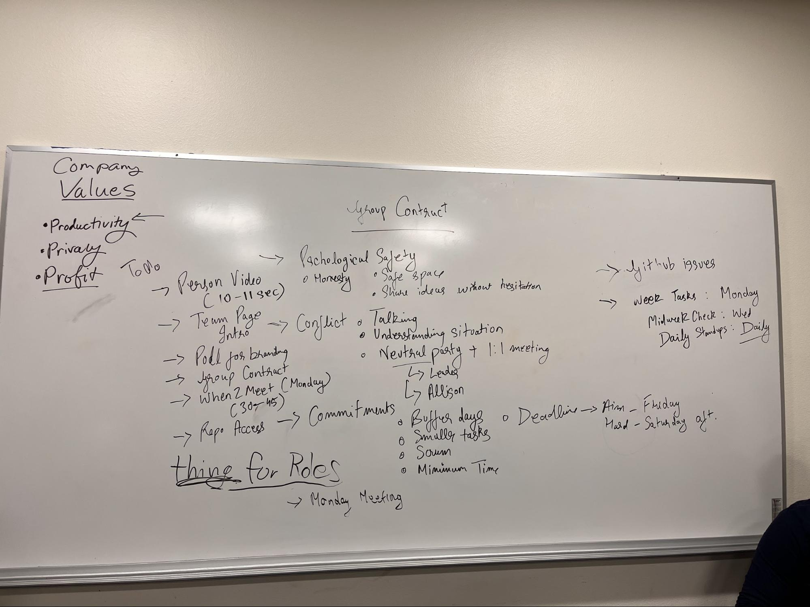

# Friday, October 14
### Contents
Attendance
Agenda
Group Bonding
Branding & Video
Repo Kickoff
Contract
Notes
TODO

### Attendance
- John
- Divyam
- Vedant
- Tung
- Hugo
- Rachel
- Yousuf
- Nina
- Thu
- Jason
- Allison

## Agenda
- Group bonding activity
- Branding & Video
	- What values do you/we have?
	- What ideas do you have for logos, colors, etc.
- Repo Kickoff
	- What strengths do you bring to this team?
	- What role would you like to play in our team?
Group Contract
	- What is expected of you and others?

## Group Bonding Activity
There is a lot to take care of, last week's zoom meeting (introductions) will count as group bonding event.

## Branding & Video
- Ideas for Video:
	- Record brief introduction video, uploaded to google drive, John will compile and submit.
	- **max 10 seconds**

- Team Name & Theme
	- Parody (i.e. Pear)
	- Try Hards
	- Sword Fish
	- Parkour
	- Powell Rangers
	- Powell Puff
	- Captain Foobar
	- Tweet Bots
	- Tweet X

- Values
	- Productivity
	- Honesty
	- Privacy
	- Profit

## Repo Kickoff
- Repo [https://github.com/cse110-fa22-group38/cse110-fa22-group38](https://github.com/cse110-fa22-group38/cse110-fa22-group38)

## Group Contract
1. Psychological Safety
	- safe space, no prejudice
	- Share ideas without hesitation (shouldn’t worry about other people attacking your ideas)
	- Be 100% honest on where you’re at. If you’re stuck on something or have emergencies, tell us. We will work it out.
2. Conflicts
	- For example, if there is no clear majority. Team leads can be decisive and steer the group into a certain direction.
	- Understanding the situation. 
	- Neutral party (team leads, TA). 1:1 meeting.
3. Commitments
	- 15-20 minutes per day for the project => 1-2 hours per week. Expect some crunch near deadlines.
	- Scrum master (Tung) keeps track of progress (Notifying people that other people need help and keeping track of everyone’s progress).
	- Buffer days when things go wrong. (soft deadlines are Fridays, hard deadlines are Saturday)
	- Break bigger tasks into multiple smaller tasks.
4. Github issues & future meetings
	- Weekly tasks will be published on: Monday (30 - 45 minutes)
	- Midweek check: Wednesday (15 - 20 minutes)
	- Scrum master will check in with everyone on where they are at and which part they are stuck at.
	- Daily standups: Daily (shouldn’t take more than 5 minutes)
### Notes
- Make separate channels on slack for notifications & meeting minutes

## TODO
1. Personal Video Recording (10-12 seconds)
2. Team Page Information
3. Poll for Team Name
4. Group Contract (Sign & Upload)
5. When 2 Meet (for Monday)
6. Repo Access
7. Pole for Roles

### Media

