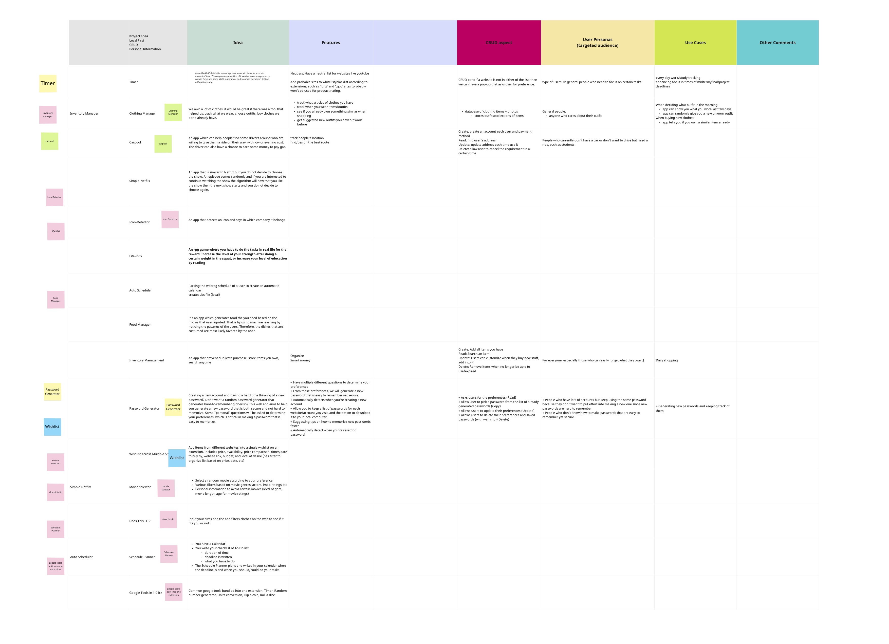

# Friday, October 21 (2 hours long)
### Contents
- Attendance
- Agenda
- Project Ideas
- Social Ideas
- Other concerns
- TODO AFTER MEETING

### Attendance
- John
- Divyam
- Vedant
- Tung
- Hugo
- Rachel
- Yousuf
- Nina
- Thu
- Jason

## Agenda
- Project ideas on Miro whiteboard
- Social Ideas (optional)

## Project Ideas
### Reminder for the **requirements** of the projects:
- Information storage
- "Personal"
- Local First "privacy"
- App made with "Core Web"
  + Ex: html, css, Javascript

**Brainstorming and voting on Miro whiteboard:**
https://miro.com/app/board/uXjVPLlcz60=/

**Top 3 results:**
Consult with the respective pictures for more details:

- Schedule Planner (8 votes): 
  + C: Add task
  + R: Read task
  + U: Update wrong entries
  + D: Delete after it ends

- Movie Selector (7 votes): 
  + C: #TODO
  + R: #TODO
  + U: #TODO
  + D: #TODO

- Timer (7 votes): 
  + C: #TODO
  + R: #TODO
  + U: #TODO
  + D: #TODO

## Social Ideas
- Bonfire at the beach
- Movie
- Beach Day
- Improvise/Comedy

## Other concerns
N/A

## TODO AFTER MEETING
1) Deciding which idea we should go with. Ideally by  **Monday's Noon**  so we can propose to Allison and get started early.
2) Think about which role you want to do (once we have decided the project)
3) (Optional) Deciding which group bonding activity we want to do.

### Primary Whiteboard

### Miro Board:

