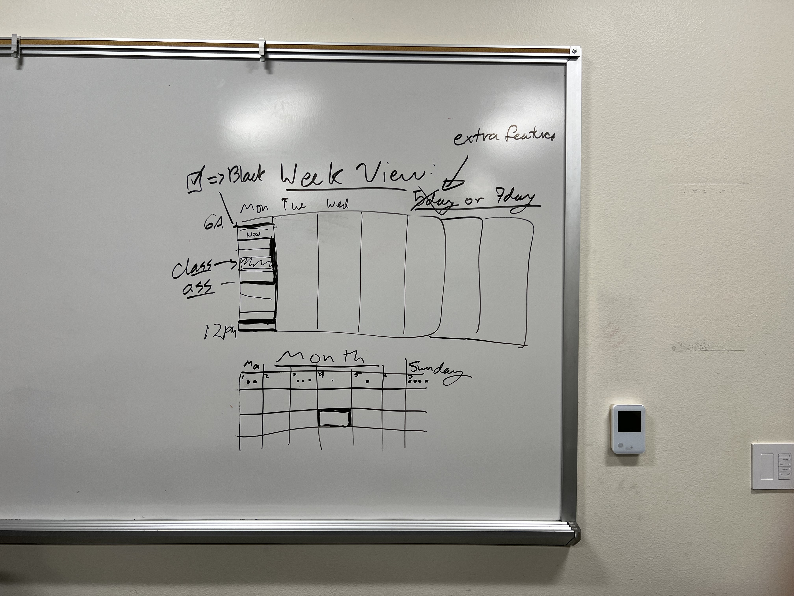
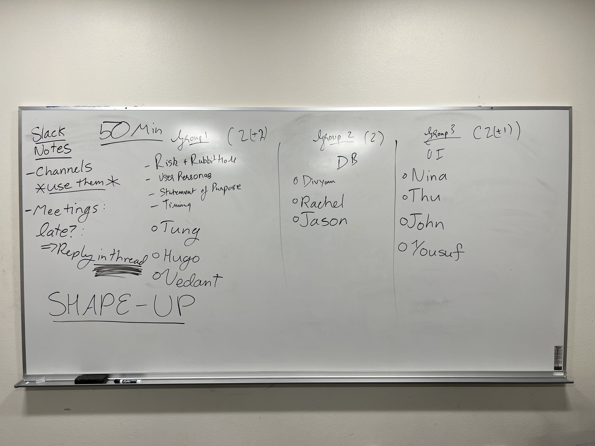

# [Friday], October 28th 1:00pm (CTH 339)
# Pitching project to TA

### Attendance
- [x] Divyam
- [x] John
- [x] Jason
- [x] Tung
- [x] Hugo
- [x] Thu
- [ ] Rachel
- [x] Nina
- [x] Vedant
- [x] Yousuf

### Agenda
- Role assignments
- Pitching
- Slack Notes
- **Comments and concerns from TA Allison**
- TODO
- Media

## Role assignments
We divided 10 members into 3 groups:

### Group 1's responsibilities:
- Risk + Rabbit Hole
- User Personas
- Statement of Purpose
- Timeline

### Members:
- Tung
- Hugo
- Vedant

### Group 2's responsibilities:
- Database Design

### Members:
- Divyam
- Rachel
- Jason

### Group 3's responsibilities:
- UI Design

### Members:
- Nina
- Thu
- John
- Yousuf

## Pitching
- After we assigned roles, we prepared the google slides to pitch to Allison.
- Link to google slides: https://docs.google.com/presentation/d/1x8G2aKh_KCYtxiBycbKCJjevj6BCutOLHxCLwquZty8/edit#slide=id.g1733f10ea82_2_35

## **Comments and concerns from TA Allison**
- Why are you choosing to use PostgresQL Database (what features do you really need from it that aren't available from vanilla Javascript)?
- PostgresQL's setting up part can be terrible.
  - **Answer**: PostgresQL is more structured and the standard that we use in the industry. And Divyam has experience with it before. (got lost over the technical jargons here).
- PostgresQL may not be familiar with the user audiences (which are UCSD students) and that can be a lot of works just to set it up before they can use the app.
	- **Answer**: We will keep that in mind and try both options. We will also look at other options in the mean time. 
- For each individual assignment, do you have a way to block out time for these tasks?
  - **Answer**: Subtask assignments with available time blocks
- What would make me want to use your calendar over other apps such as Google Calendar, Yahoo Calendar or Trello.
  - **Answer**: It is automatic and has some features that will be strictly optimized for UCSD Students (Quarter Schedules), unlike the generic approach that other calendars have. 
- Did you guys do user research or talk to friends, or you came up with all these based on your personal experiences? 
  - **Answer**: We based our design on a limited amount of friends that we know. But of course we will ask for more feedbacks for our deisgn philosophy along the development cycles. 
- What is 80% bug free?
  - **Answer**: Everything is working without breaking (at least the core logic)
-  You guys should make a plan B for "minimum viable product" in case that the "automatic" functionalities do not work. So that I can argue for you a higher grades.
	-  **We need a C4 Diagram.** (Like a detailed planning or flowchart)
-  Build something a lot simpler first (json storage) and then implement all the extra bells and whistles like Postgres if the simpler version is working properly.

## Slack Notes
- Use Channels
- Meetings: late?
- **Reply in thread**

# TODO
- John updating on the slides
- Someone making the flowchart or C4
- Making the barebone index.html + link to javascript
- **READ THE SHAPE UP BOOK** (or at least skim over it)

## Media

