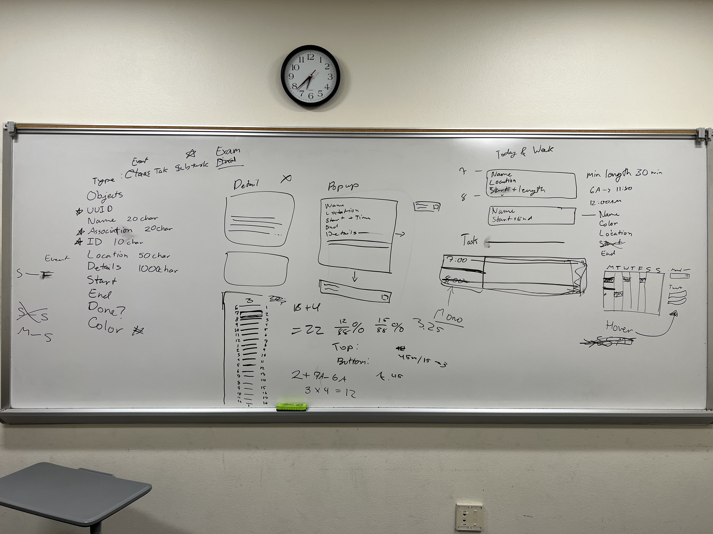
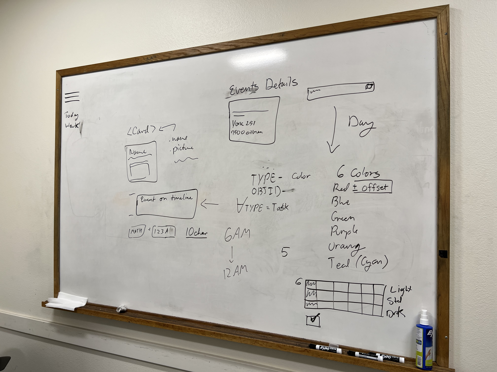

# Friday, November 4th 1-3pm (CTH 329)
# Front End Assignments & Elements Design

### Attendance
- [x] John
- [x] Hugo
- [x] Thu
- [x] Nina

### Agenda
- Designing element types
- Assignments

## Designing Element Types
We need to come up with the data required for implementing the required data types. We also needs to come up with how the event and task elements will look on the page.

- data types: 
- UUID
- ID
- Association
- Name
- Location
- Details
- Start
- End
- Done
- Color

Events show up on page. Timeline elements have less details because they are smaller.

Click on events and tasks for a pop-up to see everything and edit.

Check whiteboard images for more details.

**Notes**
- will have to communicate this to backend for database development.
- absolute positioning on the timeline is difficult. May not handle overlapping elements well.
	- solve this later if time

## Assignments
brief description
- Login Signup : Hugo
- Settings View : Thu
- Today View : Nina & John

## Media

